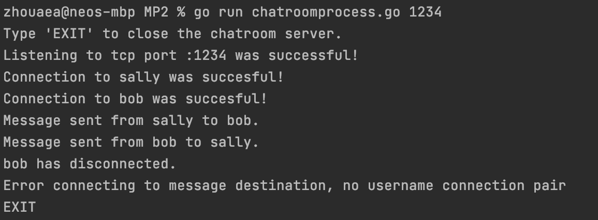
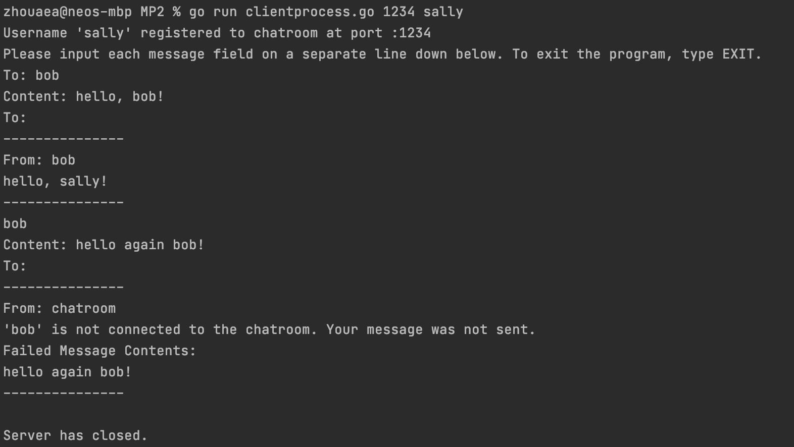
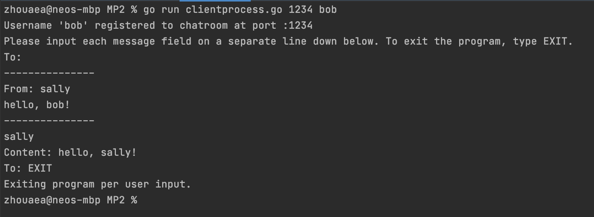

## MP2
MP2 is a simple TCP messaging application that uses a centralized chatroom to route messages from clients.

## How to Run
### Step 1: Initialize a Chatroom
Start the chatroom with `go run chatroomprocess.go <tcp_port_number>`
### Step 2: Initialize Clients
Initialize any number of clients with `go run clientprocess.go <chatroom_port_number> <client_username>`
### Step 3: Interact with Command Line
#### Chatroom Process
- Type EXIT into the command line to terminate the process
#### Client Process
- Type EXIT into the command line to terminate the process
- Type the username of client you'd like to send a message to and type the contents of that message into the command line

## Screenshots (Two Client Example)
### Chatroom

### Client 1

### Client 2


## Workflows
### Chatroom Workflow 

### Client Workflow


## Custom Data Structures
1. Message Struct
```go
type Message struct {
   To string
   From string
   Content string
}
```
2. Username-Connection Lookup Map
```go
var clientLookup = make(map[string]net.Conn)
```
## Package Design
### Application
- `chatroomparsing.go` contains functions for parsing initial command line arguments and reading the command line to
  terminate a chatroom process upon user request
- `clientparsing.go` contains functions for parsing initial command line arguments and reading the command line to 
  construct messages and terminate a client process upon user request
### Network
- `chatroom.go` contains functions for listening to a TCP port as well as routing messages from client to client
- `client.go` contains functions for establishing a connection to a TCP port as well as sending and receiving messages 
  to and from the chatroom
- `communication.go` contains functions for writing and reading messages to a TCP channel via gob
### Messages
`messages.go` contains the Message struct
### Error Checker
`errorchecker.go` contains a function to check for errors for initial TCP connection functions.
### Images
Contains all the images used in this README.


## Exit Codes:
- `0`: Successful
- `1`: Incorrect command line input format
- `2`: External package function error

## References
- My error checking function, `CheckError()`, is a modified version of sample code from [Network Programming with Go](https://ipfs.io/ipfs/QmfYeDhGH9bZzihBUDEQbCbTc5k5FZKURMUoUvfmc27BwL/socket/tcp_sockets.html).
- My exact implementation of establishing a TCP connection on both client and server side was taken from [this linode tutorial](https://www.linode.com/docs/guides/developing-udp-and-tcp-clients-and-servers-in-go/).
